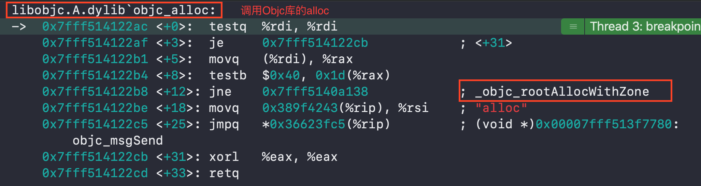

## iOS 底层摸鱼 - alloc流程分析
### alloc 初探
在业务层开发时，很少会对Objc源码进行探究。所以对一些系统方法底层具体执行了哪个库的哪写方法，就不得而知，往往就止步于此。
这里推荐一个好的方法：汇编调试。具体开启方法：
`（Xcode->Debug->Debug workflow->Always Show Disassembly）`

👇进入正题（撸代码）：
直接在`main`函数 `alloc`出一个继承`NSObject`的对象：
`FLObject = [FLObject alloc];`
打好断点后运行，并开启汇编调试

