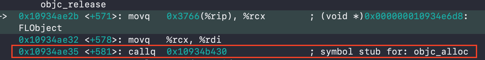

## iOS 底层摸鱼 - alloc流程分析
### alloc 初探
在业务层开发时，很少会对Objc源码进行探究。所以对一些系统方法底层具体执行了哪个库的哪写方法，就不得而知，往往就止步于此。
这里推荐一个好的方法：汇编调试。具体开启方法：
`（Xcode->Debug->Debug workflow->Always Show Disassembly）`

👇进入正题（撸代码）：
在测试项目新建一个继承`NSObject`的类，并`alloc`出一个实例对象：
`FLObject *object = [FLObject alloc];`
打好断点后运行，并开启汇编调试

如图，我们可以看到下一条指令的汇编注释`symbol stub for: objc_alloc`得知立即调用存根符号为`objc_alloc`的函数，所以我们不妨增加一个`objc_alloc`的符号断点，接着运行可以看到

所以可以看到在调用`NSObject *objc = [NSObject alloc];`    时，其实调用的是`objc`库中的`objc_alloc`方法。
